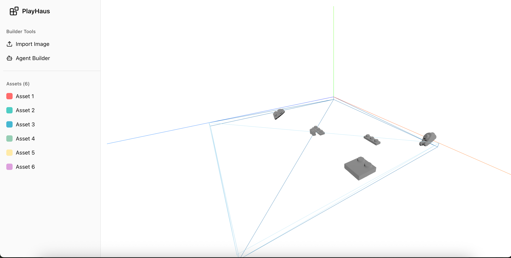

# Bootstrap Reality - AI-Powered LEGO Builder

A hackathon project that combines computer vision, AI, and 3D modeling to create an interactive LEGO building experience. Upload images of LEGO pieces and watch them come to life in a 3D virtual environment with AI-assisted building capabilities.

## 📸 Screenshots



*Interactive 3D LEGO building interface with AI-powered assistance*

## 🚀 Features

### Core Functionality
- **Image-to-3D Conversion**: Upload images of LEGO pieces and automatically generate 3D models
- **Computer Vision Segmentation**: Intelligently detect and segment individual LEGO pieces from images
- **3D Interactive Environment**: Drag and drop 3D LEGO pieces in a virtual workspace
- **AI Builder Assistant**: Get AI-powered suggestions for LEGO piece placement and arrangement
- **Real-time 3D Rendering**: Smooth 3D visualization with lighting, shadows, and camera controls

### Technical Highlights
- **Multi-Model AI Pipeline**: Uses Tencent Hunyuan3D-2 for 3D generation and GPT-4 for building assistance
- **Advanced Computer Vision**: Multiple segmentation algorithms (Otsu thresholding, HSV color-based, edge detection)
- **Fallback Mechanisms**: Grid-based segmentation when CV algorithms fail
- **WebGL 3D Rendering**: Built with Three.js and React Three Fiber for smooth performance

## 🏗️ Architecture

### Backend (FastAPI)
- **`/segment-and-generate`**: Main endpoint that segments images and generates 3D models
- **`/agent-builder`**: AI assistant for LEGO building suggestions
- **`/assets`**: Serves 3D asset files (GLB format)
- **Computer Vision Pipeline**: OpenCV-based segmentation with multiple algorithms
- **AI Integration**: Replicate API for 3D generation, OpenAI for building assistance

### Frontend (Next.js + React Three Fiber)
- **3D Canvas**: Interactive 3D environment with Three.js
- **Asset Management**: Sidebar for managing LEGO pieces and colors
- **Drag & Drop**: Intuitive 3D object manipulation
- **Camera Controls**: Orbit controls for navigation
- **UI Components**: Modern sidebar interface with Tailwind CSS

## 📁 Project Structure

```
bootstrap_reality/
├── backend/
│   ├── server.py              # FastAPI server with AI endpoints
│   ├── research.ipynb         # Computer vision research notebook
│   ├── cad_assets/            # 3D model assets (GLB files)
│   ├── image_assets/          # Sample LEGO images
│   └── .env                   # Environment variables (API keys)
├── lego-builder/
│   ├── app/
│   │   ├── page.js            # Main 3D application
│   │   ├── asset.jsx          # 3D asset component
│   │   ├── draggable.jsx      # Drag & drop functionality
│   │   ├── orbitControls.jsx  # Camera controls
│   │   └── bench.jsx          # 3D floor/bench
│   ├── components/ui/         # Reusable UI components
│   └── package.json           # Frontend dependencies
└── README.md                  # This file
```

## 🛠️ Setup & Installation

### Prerequisites
- Python 3.8+
- Node.js 18+
- API Keys: OpenAI, Replicate

### Backend Setup
```bash
cd backend
pip install fastapi uvicorn opencv-python numpy replicate python-dotenv openai
uvicorn server:app --reload --port 8000
```

### Frontend Setup
```bash
cd lego-builder
npm install
npm run dev
```

### Environment Variables
Create `backend/.env`:
```
OPENAI_API_KEY=your_openai_key
REPLICATE_API_TOKEN=your_replicate_token
```

## 🎮 Usage

1. **Start the Backend**: Run the FastAPI server on port 8000
2. **Start the Frontend**: Run the Next.js app on port 3000
3. **Upload Images**: Use the "Import Image" button to upload LEGO piece images
4. **Generate 3D Models**: The system will automatically segment and convert images to 3D
5. **Build Interactively**: Drag and drop 3D pieces in the virtual workspace
6. **Get AI Help**: Use "Agent Builder" for AI-powered building suggestions

## 🔧 Technical Details

### Computer Vision Pipeline
1. **Image Preprocessing**: Gaussian blur, color space conversion
2. **Multi-Algorithm Segmentation**:
   - Otsu's thresholding for binary segmentation
   - HSV color-based segmentation for colorful objects
   - Edge detection with Canny algorithm
3. **Contour Analysis**: Area filtering, aspect ratio validation
4. **Fallback Grid Segmentation**: 2x2 grid when CV fails

### AI Integration
- **3D Generation**: Tencent Hunyuan3D-2 via Replicate API
- **Building Assistant**: GPT-4 for placement suggestions
- **Error Handling**: Graceful fallbacks and timeout management

### 3D Rendering
- **Three.js**: WebGL-based 3D graphics
- **React Three Fiber**: React integration for Three.js
- **Performance**: Optimized rendering with shadows and lighting

## 🎯 Hackathon Goals

This project demonstrates:
- **AI/ML Integration**: Multiple AI models working together
- **Computer Vision**: Advanced image segmentation techniques
- **3D Graphics**: Real-time 3D rendering and interaction
- **Full-Stack Development**: Modern web technologies
- **User Experience**: Intuitive drag-and-drop interface

## 🔮 Future Enhancements

- **Real-time Collaboration**: Multiple users building together
- **Physics Simulation**: Realistic LEGO piece interactions
- **AR Integration**: Augmented reality building experience
- **Mobile Support**: Touch-optimized mobile interface
- **Advanced AI**: More sophisticated building suggestions

## 📝 License

This project was created for hackathon purposes. Feel free to use and modify for educational or personal projects.

---

*Built with ❤️ during a hackathon to explore the intersection of AI, computer vision, and 3D graphics.*
